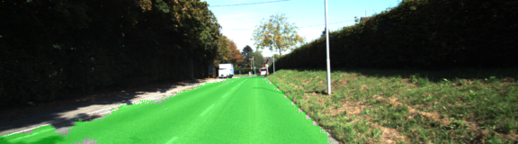
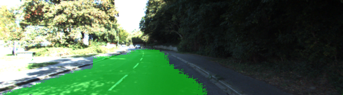
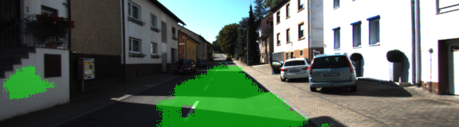

# Semantic Segmentation Project

This is a brief summary of my Semantic Segmentatin Project implementation.

The full original description by Udacity can be [read here](README_udacity.md).


My implementation relies heavily, in addition to the classroom notes and the project walkthrough, 
to the paper 
[Fully Convolutional Networks for Semantic Segmentation](https://people.eecs.berkeley.edu/~jonlong/long_shelhamer_fcn.pdf) 
by Jonathan Long, Evan Shelhamer and Trevor Darrell. 

In addition, I consulted 
[Jeremy Shannon's implementation](https://github.com/jeremy-shannon/CarND-Semantic-Segmentation/) for some details. 
Specifically, I picked the kernel initialization code and some hints about the train_nn 
function from Jeremy. The rest of the implementation was fully my own work.  

## The Problem

The task was to download a previously trained VGG network, and use it to build a FCN-8 network as per the previosly 
mentioned paper. This architecture was then used to train a one-shot fully convolutional network for semantic 
segmentation, with the specific aim to classify pixels in images as either road or non-road. 

## My Solution

### Network Structure

My code makes use of keyword argument packing to reduce code duplication. All the 1x1 convolution layers and the 
deconvolution layers share the following set of parameters:  

```python
common_params = {"filters": num_classes,
                 "padding": "same",
                 "kernel_regularizer": tf.contrib.layers.l2_regularizer(1e-5),
                 "kernel_initializer": tf.random_normal_initializer(stddev=0.01)}
```

The full list of parameters for 1x1 convolution is as follows. 

```python
params_1x1 = {"kernel_size": 1, "strides": (1, 1), **common_params}
```

The 2x upsampling parameters are: 

```python
params_2x = {"kernel_size": 4, "strides": (2, 2), **common_params}
```

Finally, the 8x upsampling layer parameters are: 
```python
params_8x = {"kernel_size": 16, "strides": (8, 8), **common_params}
```

Now, the network structure is defined as 

```python
# 1x1 conv on layer7 and upscale
layer7_conv_1x1 = tf.layers.conv2d(vgg_layer7_out, **params_1x1)
layer7_2x = tf.layers.conv2d_transpose(layer7_conv_1x1, **params_2x)

# 1x1 conv on layer4 and combine with previous upscaled layer7, then upscale once more
layer4_conv_1x1 = tf.layers.conv2d(vgg_layer4_out, **params_1x1)
layer_2x_combo = tf.add(layer7_2x, layer4_conv_1x1)
combo_layer_7_and_4_4x = tf.layers.conv2d_transpose(layer_2x_combo, **params_2x)

# 1x1 conv on layer4 and combine with previous 4x upscaled layer7
layer3_conv_1x1 = tf.layers.conv2d(vgg_layer3_out, **params_1x1)
layer_4x_combo = tf.add(combo_layer_7_and_4_4x, layer3_conv_1x1)

# Now we have combined the 1x1 conv'ed versions of layer 7, 4 and 3. As a final step,
# upscale the resulting layer back to the original scale (8x) and return.
return tf.layers.conv2d_transpose(layer_4x_combo, **params_8x)

```

### The `load_vgg` function

The load_vgg function was fully implemented in the project walkthrough video and my implementation contains no 
original work. The code can be read in `main.py` on lines 21-44. 

### The `optimize` function

The `optimize` function mainly just reshapes the logits and labels to a 2-dimensional vector and then implements
a standard cross entropy loss minization. the code is as follows. 

```python
# Reshape both the output classifications and the correct labels to a one-dimensional array
logits = tf.reshape(nn_last_layer, (-1, num_classes))
correct_labels = tf.reshape(correct_label, (-1, num_classes))

# Build the loss function, optimizer and training operation based on the reshaped logits and labels.
cross_entropy_loss = tf.reduce_mean(tf.nn.softmax_cross_entropy_with_logits(logits=logits, labels=correct_labels))
optimizer = tf.train.AdamOptimizer(learning_rate=learning_rate)
train_op = optimizer.minimize(cross_entropy_loss)
return logits, train_op, cross_entropy_loss

```

### The `train_nn` function

The `train_nn` function basically just consists a loop over epochs an batches of training images, and then
making use of TensorFlow's `session.run` function with an appropriate feed_dict containing the 
actual values for the image and label tensors and learning_rate and keep_prob. My implementation of the loop is as 
follows. 

```python
for epoch_idx in range(epochs):
    print("STARTING EPOCH {}".format(epoch_idx + 1))
    for idx, (image, label) in enumerate(get_batches_fn(batch_size)):
        print("STARTING BATCH {}".format(idx + 1))
        out, loss = sess.run([train_op, cross_entropy_loss], feed_dict={input_image: image, correct_label: label, keep_prob: 0.5, learning_rate: 0.001})
        print("Loss: = {:.3f}".format(loss))

```

### Hyperparameter values

These are the hyperparameter values I used for training the network: 

* learning_rate: 0.001
* keep_prob: 0.5
* num_epochs = 36
* batch_size = 32

### Results & Discussion

Let us take a look at some images resulting from a  

The first one - representing the majority of the results - is a relatively nice separation of road pixels from the 
rest of the image



The remaining two samples are examples of different degrees of failed classification. This is apparently due to 
variations in image lighting. It is rather probable that these misclassifications could be mitigated with 
careful preprocessing and augmentation of the training data.  





### Conclusion

I liked the fact that the project template was very carefully written. Yet, the meat of the solution had to be 
understood and implement independently. The classroom material included just enough hints so I was able to 
write most of the code and define the architecture myself. This was a fun and rewarding project. 

I would have liked to implement also the video part, but had to skip and proceed with the rest of the program.  

Also, I would have liked to try out some preprocessing (maybe contrast normalization) and augmentation techniques. 
Augmentation (other than simple rotations, additions of noice etc.) of pixel-by-pixel hand-labelled images is probably 
somewhat involved and I made no attempt at coming up with such ideas. 

